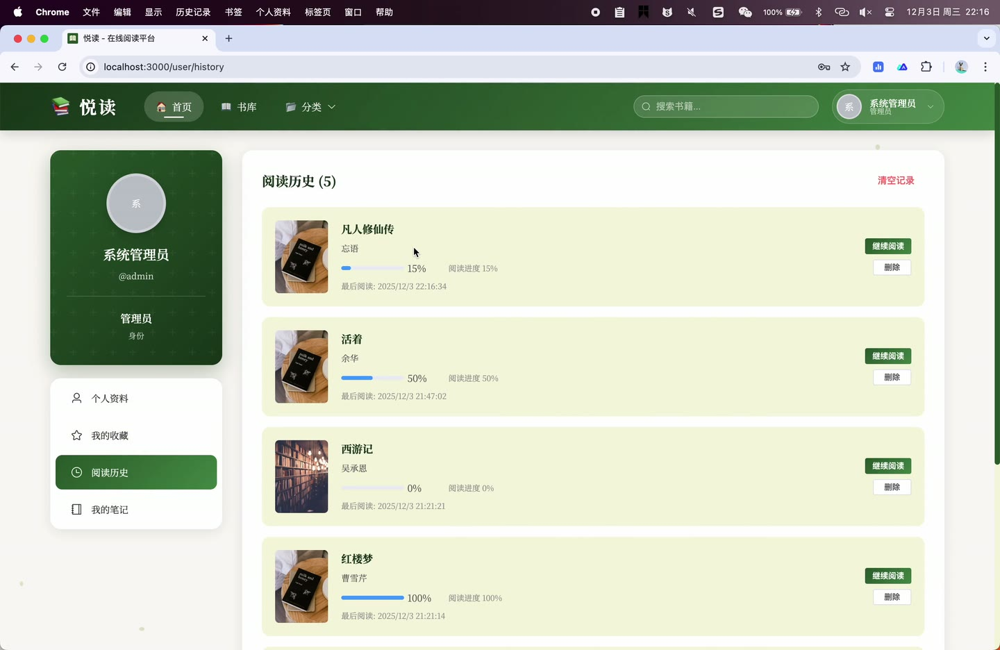
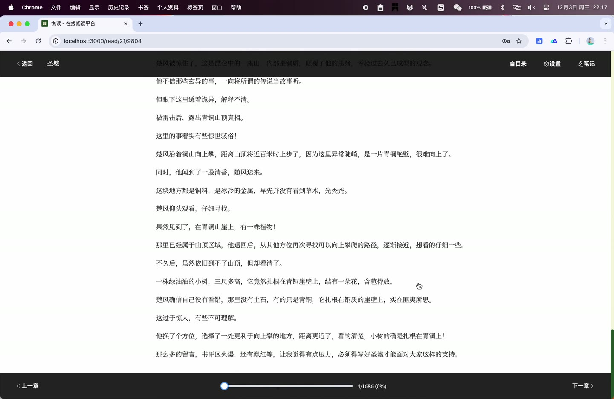

# (附文档)Springboot3+Vue3+MySQL 小说在线阅读

**技术栈**：Springboot2、Vue3、MySQL

### Springboot2+Vue3+MySQL 小说在线阅读平台
 
### 系统简介

本系统是一个基于 Spring Boot 2 + Vue 3 前后端分离的小说在线阅读平台，支持用户注册登录、书籍搜索阅读、章节管理、阅读进度同步、读书笔记、评论互动、收藏管理等功能。后台提供完整的用户管理、书籍管理、分类管理、轮播图管理、评论审核、数据统计看板等运营工具。
 
### 核心功能
 
### 普通用户端

 
- 用户注册与登录：使用用户名密码注册新账号，登录后获取 JWT Token 用于后续请求鉴权 
- 书籍浏览与搜索：按分类筛选书籍，支持关键词搜索书名/作者，分页展示书籍列表 
- 书籍详情查看：查看书籍封面、作者、分类、简介、总章节数、字数、阅读量、点赞数、收藏数 
- 章节列表与阅读：按顺序展示书籍所有章节标题，点击进入阅读页显示章节正文内容 
- 阅读进度同步：自动记录当前阅读的章节和阅读进度百分比，下次进入自动跳转到上次阅读位置 
- 阅读设置自定义：调整字体大小、字体类型、行高、背景颜色、主题（明亮/护眼） 
- 书籍收藏与取消：收藏喜欢的书籍到个人书架，取消收藏时同步减少书籍收藏计数 
- 书籍/评论点赞：对书籍或评论进行点赞操作，取消点赞时同步减少点赞计数 
- 发表评论与回复：对书籍发表评论，支持回复已有评论形成楼层式讨论 
- 读书笔记管理：在阅读过程中添加笔记（可关联章节和选中文本），编辑或删除已有笔记 
- 阅读历史查看：按最近阅读时间倒序展示阅读过的书籍，支持删除单条历史记录 
- 个人信息管理：修改昵称、邮箱、手机号、头像，修改登录密码（需验证原密码） 
- 首页轮播图展示：查看管理员发布的轮播图，点击可跳转至对应链接 
- 热门书籍推荐：首页展示按阅读量排序的热门书籍列表 
- 个性化推荐：基于用户阅读历史推荐相同分类的其他书籍，若无历史则展示推荐书籍列表
 
### 管理员端

 
- 数据统计看板：查看用户数、书籍数、分类数、评论数、笔记数，累计阅读量/收藏数/点赞数 
- 近7天新增统计：查看最近7天新增用户数和新增书籍数 
- 分类分布统计：查看每个分类下的书籍数量分布 
- 热门书籍TOP10：查看阅读量最高的10本书籍及其作者和收藏数 
- 用户增长趋势：查看最近7天每日新增用户数曲线数据 
- 用户管理：分页查看用户列表，按用户名/昵称搜索，新增用户，编辑用户信息（角色/状态），启用/禁用用户账号，删除用户 
- 书籍管理：分页查看书籍列表，按关键词搜索书籍，上传TXT/EPUB文件自动解析章节，上传书籍封面图片，编辑书籍信息（标题/作者/分类/简介），修改书籍状态（上架/下架），设置/取消推荐，删除书籍 
- 分类管理：查看所有分类列表，新增分类（名称/描述/图标/排序），编辑分类信息，删除分类 
- 轮播图管理：查看轮播图列表，新增轮播图（标题/图片/链接/排序/状态），编辑轮播图，删除轮播图 
- 评论管理：按书籍筛选评论列表，删除违规评论，设置评论状态（显示/隐藏） 
- 通用文件上传：上传图片等文件，返回可访问的URL路径
 
### 技术栈

 后端框架Spring Boot 2 ORMMyBatis-Plus 权限认证Spring Security + JWT 缓存Redis 前端框架Vue 3 状态管理Vuex / Pinia 构建工具Vite 数据库MySQL 数据库连接池HikariCP 文件上传MultipartFile 项目构建Maven
 
### 交付内容

 
- 后端完整源码 
- 前端完整源码 
- 数据库初始化脚本 
- 万字文档

## 界面展示

---

## 获取完整源码 + 万字文档

本仓库为项目介绍页。**完整前后端源码、数据库初始化脚本、万字项目文档**，请加微信 `kangkangcode`，或访问 [codekk.top](http://codekk.top) 获取。

可作课程设计 / 毕业设计参考，支持远程部署调试。